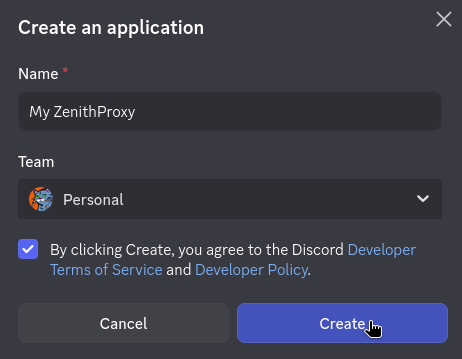
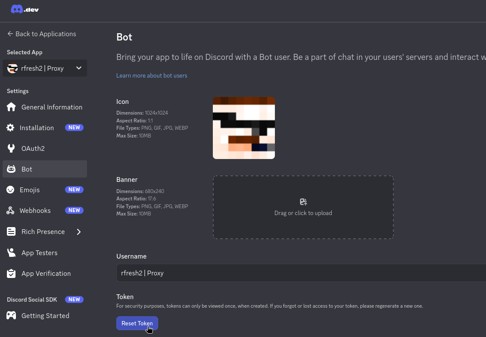
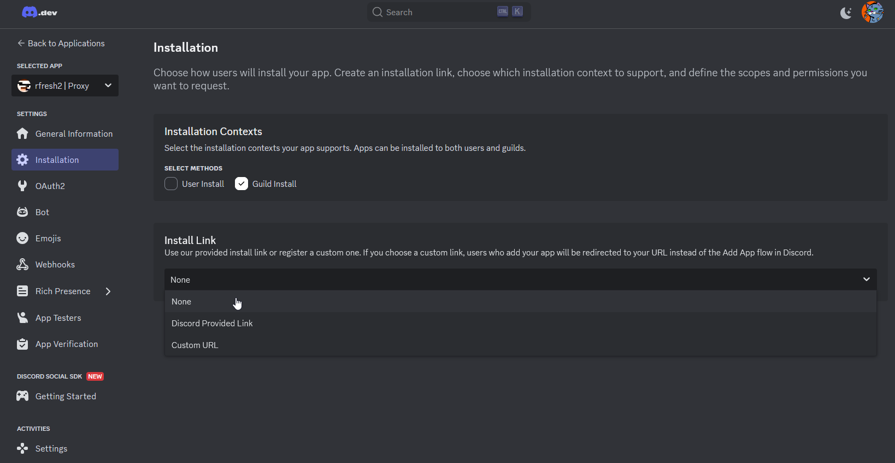
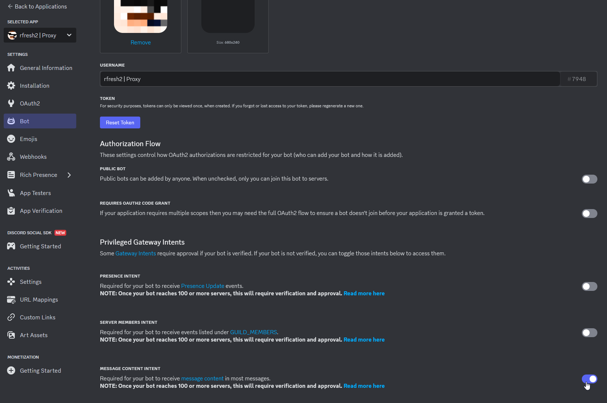
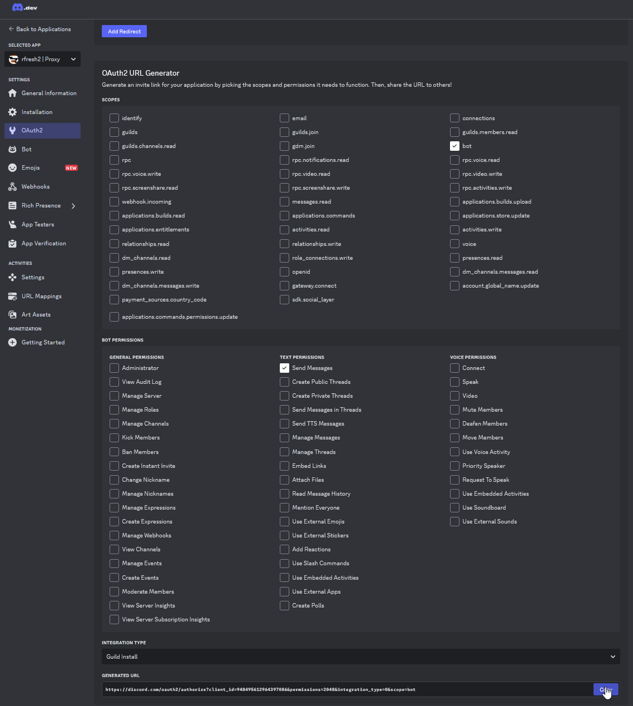
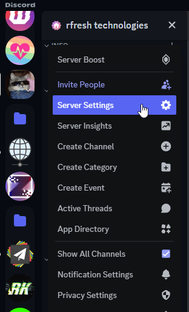
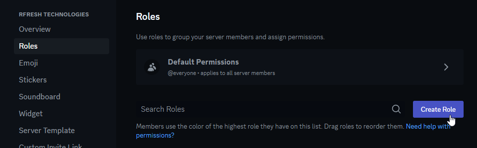
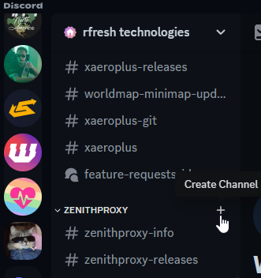
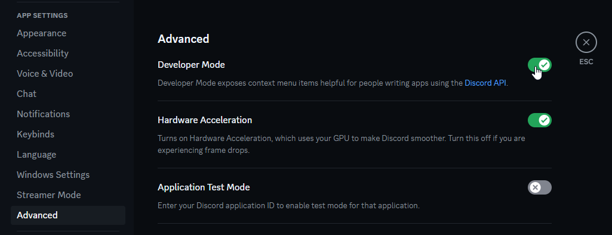
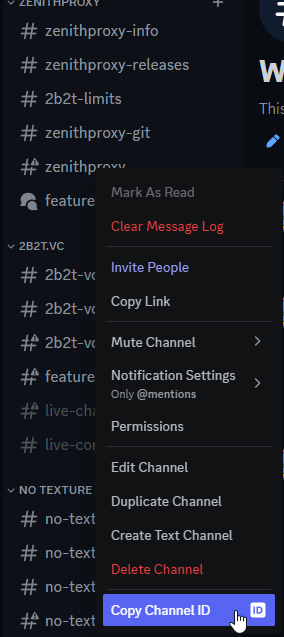

# Discord Bot Guide

## Create Bot

Create a discord bot here: https://discord.com/developers/applications

Click the `New Application` button, give it any name, and select `Create`



## Bot Token

On the left sidebar, select `Bot`, then click `Reset Token`



After confirmations, the token and a `Copy` button should appear

## Bot Settings

In the `Installation` tab settings:

* set `Install Link` to None
* `Guild Install` should be checked
* `User Install` doesn't matter.



In the `Bot` tab:

* Enable `Message Content Intent`
* Disable `Public Bot`



## Invite Bot To Server

In the `OAuth2` tab, generate an invite link with these permissions:



Open the invite link in a web browser and select the server to invite the bot to

## Discord Server Setup

In the discord server settings:



1: Create a role for users to manage the bot:



2: Assign the role to yourself and any other users who should be able to manage the bot.

3: Create a channel to manage the bot in:



4: (Optional) Create another channel for ZenithProxy's chat relay (live chat)

## Configure ZenithProxy

At first launch, the launcher will ask you to configure the token/role/channel ID's

If you didn't do this or misconfigured it, you can use the [discord](Commands.md#discord_1) and [chatRelay](Commands.md#chatrelay) commands after

To get the role and channel ID's, you must enable `Developer Mode` in your discord user settings:




Right-click on the roles/channels you created and click `Copy ID`



## Members channel (read-only feed)

A **members channel** is an optional second channel that mirrors a curated, **coordinate-scrubbed**
subset of notifications — `online`, `offline`, `queue`, `prio` gained/lost, `pearl pulled for <user>`,
and `visual range` (a player entered/left range) — for non-admin "members" who share the bot. It is
**read-only**: commands are never accepted there (that stays your admin channel). Ships **off**.

It is **RBAC-gated** (see [Access Control](Access-Control.md)) by *classification*, not by login: the
channel carries an **audience role**, and each notice and each sensitive detail (coordinates, the proxy
IP) carries a **minimum role**. A notice posts only when the audience role is at least the notice's role;
a sensitive field is stripped unless the audience clears its threshold. So a `guest` channel shows status
with coordinates and the proxy IP removed; an `operator` channel shows coordinates too — same channel,
same code. This works whether or not the full RBAC system is enabled.

> **Who can see it is up to Discord, not the bot.** Set the channel's per-role View/Send permissions in
> Discord so only the people you intend can read it. The bot only decides *what* to mirror, by the
> audience role you assign.

Set it up (terminal or the admin channel) — see [`members`](Commands.md#members):

```
members channel <channelId>     # a NEW channel, different from the admin + chat-relay channels
members audience guest          # who this channel is for (none/guest/user/operator/admin)
members on
```

Tune it: `members notice <online|offline|queue|prio|pearlpull|visualrange> <role|off>` to gate or disable a
notice, `members coords <role>` / `members proxyip <role>` to move the scrub thresholds, or `members panel`
for a button/dropdown control panel. `members` with no argument prints the current status.

**Visual-range coordinates** are the one notice that exposes the bot's own position, so they get a dedicated
switch: `members visualrangecoords on/off`. While **off** (default) coordinates are *always* stripped from
mirrored visual-range alerts, regardless of the `coords` threshold; turn it **on** to let them follow the
normal `coords` threshold. Visual range defaults to a `user` minimum role (members below that don't see it
at all).
